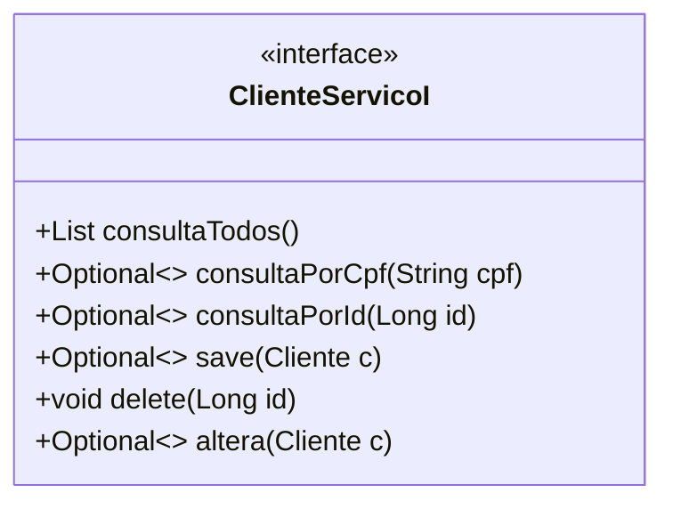
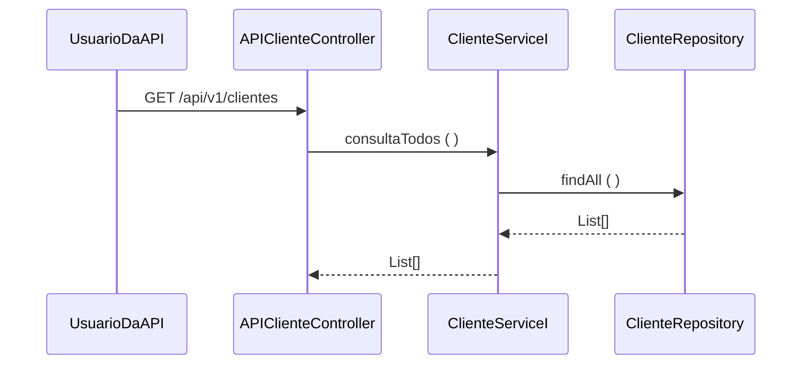

### Fatec - Centro Paula Souza
##### Curso - Desenvolvimento de Software Multiplataforma
##### Estudo de Caso – NodeBounty
> No contexto do projeto interdisciplinar o estudo de caso tem como objetivo desenvolver e implantar o Sistema NodeBounty. Esse sistema possui o referencial de fintechs modernas, que oferecem serviços e soluções de maneira prática e imediata. A fintech NodeBounty contará com o cadastro do cliente, visualização de conta corrente, serviço de cashback exclusivo, extrato bancário, transações entre contas NodeBounty e outras funcionalidades. 
Time de desenvolvimento
- Dayvid Dalton
- Eloah Baracho
- Matheus Porto
- Daniel Viegas
- Alberto Junior
##### Instalação
O projeto esta em desenvolvimento utilizando STS4 e a linguagem Java 17.
- No Github selecione a opção clone e copie o endereço do repositório.
- No STS4 abra a perspectiva Git opção clone.
- Ao terminar o download import o projeto para o workspace
- A classe nodebountyAppplication inicializa a execução do projeto
##### Processo de Desenvolvimento de Software - PDS
> O PDS segue uma abordagem interativa incremental adaptada do Scrum. A definição de pronto estabelece os mecanismos para
> controle de qualidade da aplicação.
##### Análise de risco
> O resultado da análise conclui que será possível implementar o projeto no semestre com grupos de alunos atuando como programadores. O maior risco identificado é a falta de tempo para reunião do time de desenvolvimento e estudo
do projeto. O grupo deve definir estratégias para mitigar o risco de dificuldades com a linguagem de programação, identificando membros do grupo com problemas na programação, selecionando videoaulas, referência bibliográficas, para
melhora a produtividade do time.
##### Product Backlog
> Cada requisito tem um identificador único de maneira que seja possível rastrear a necessidade do cliente com a implementação do software.
| Identificador | Descrição | Complexidade|
| ------------ | ------------------------------------------------------------------------ | ------|
| REQ01 – | Armazenar dados | O sistema deve ser capaz de armazenar os dados do cliente; | Alta |
| REQ02 – | Alterar dados   | A sistema deve ser capaz de alterar os dados do cliente; | Alta |
| REQ03 – | Exibir dados    | O sistema deve ser capaz de exibir os dados do cliente; | Alta |
| REQ04 – | Deletar dados   | O sistema deve ser capaz de deletar dados do cliente; | Alta |
| REQ05 – | Exibir histórico de transações | O sistema deve ser capaz de emitir um extrato das transações feitas anteriormente | Baixa |
##### Definição de pronto
> O sprint será considerado concluido quando:
> 1) Os casos de teste de aceitação forem executados e obtiverem 100% de satisfatorios. Os casos de teste (CT) são rastreáveis para os requisiitos (REQ). O elo de rastreabilidade
é estabelecido pelo identificador do caso de teste.
> 2) Depois de executado os casos de teste com 100% de satisfatorios o código deve ser armazenado no github (commit).
> 3) O relatório do SonarLint foi gerado e revisado.
##### Casos de teste
| Identificador | Cenário de uso |
| ------------ | ------------------------------------------------------------------------ |
| REQ06CT01 | Dado (setup) que o CPF do cliente não está cadastrado; Quando (ação) o usuário confirma o cadastro; Então (resultado esperado) o sistema envia uma mensagem de cadastro realizado com sucesso |
| REQ06CT02 | Dado (setup) que o CPF do cliente está cadastrado; Quando (ação) o usuário confirma o cadastro; Então (resultado esperado) o sistema rejeita e envia uma mensagem de dados inválidos |
>
O modelo de dominio (Larman, 2006 - classes conceituais ou classes de negócio) foi definido considerando as seguintes classes:

A arquitetura segue uma abordagem orientada a serviços. Os serviços foram classificados em três tipos (ERL, 2007):
- **1. Serviços utilitários**. Implementam funcionalidades comuns a vários tipos de aplicações, como, por exemplo: log, notificação, transformação de informações. Um exemplo de serviço utilitário é um serviço de conversão de moeda que
poderá ser acessado para calcular a conversão de uma moeda (por exemplo, dólares) para outra (por exemplo, euros).
- **2. Serviços de entidade (serviços de negócios)**. Derivado de uma ou mais entidades de negócio (domínio), possuindo um alto grau de reutilização. Geralmente são serviços que fazem operações CRUD (Create, Read, Update e Delete).
- **3. Serviços de tarefa (coordenação de processos-workflow)**. Tipo de serviço mais específico que possui baixo grau de reuso. Consome outros serviços para atender seus consumidores. São serviços que suportam um processo de negócios
amplo que geralmente envolve atividades e atores diferentes. Um exemplo de serviço de coordenação em uma empresa é um serviço de pedidos em que os pedidos são feitos, os produtos são aceitos e os pagamentos são efetuados.
A visão lógica da arquitetura para API de Cliente é apresentada na figura abaixo. A visã lógica descreve como o código está organizado, as classes os pacotes e os relacionamentos entre eles.

>A entidade Cliente foi identificada como um serviço (ERL, 2007 - serviço do tipo entidade). A visão lógica da arquitetura (Krutchen, 1995)
>descreve a organização do código. O contrato das operações de sistema (LARMAN, 2006, pag.140) foi definido no diagrama abaixo.

> Operação consulta todos - o diagrama de sequência abaixo descreve como os varios componentes do projeto devem colaborar para atender
> o comportamento da função consulta todos.

>Referencias
- [1] KRUCHTEN, Philippe. Reference: Title: Architectural blueprints—the “4+ 1” view model of software architecture. IEEE software, v. 12, n. 6, 1995.
- [2] ERL, Thomas. SOA principles of service design (the Prentice Hall service-oriented computing series from Thomas Erl). Prentice Hall PTR, 2007.
- [3] LARMAN, Craig. Utilizando UML e padrões. 2aed., Porto Alegre: Bookman Editora, 2006 (pag. 147).
